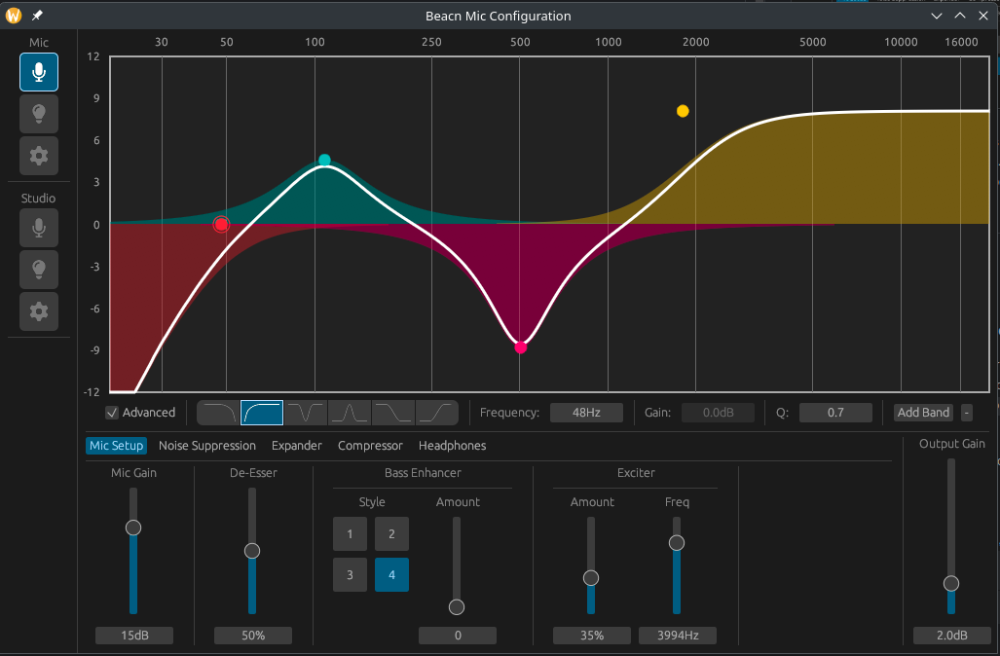

# Beacn Mic UI for Linux

A UI for configuring the Beacn Mic on Linux. Join us on [Discord](https://discord.gg/PdsscuEhMh).

***
### USE AT YOUR OWN RISK
This code directly modifies the on-board storage of the Beacn Mic. While it's been tested and made to be as safe as
is possible, it was derived from reverse engineering and thus may not be accurate.

This project is not supported by, or affiliated in any way with Beacn. For official Beacn software, please refer
to their website.

In addition, this project accepts no responsibility or liability for any use of this software, or any problems
which may occur from its use. Please read the LICENSE for more information.

***

Currently, this tool is quite barebones and basic and is likely going to stay that way, it's just for adjusting
values on the Mic. This app may  also might be slightly buggy, so expect issues. The Beacn Mic has on-board storage, so
values changed here should persist across
device reboots.
***

## Getting Started

### Setting Up the Beacn Mic on Linux
1) Install the [ALSA UCM profiles](https://github.com/beacn-on-linux/beacn-ucm-profiles) for the Beacn Hardware.
2) Copy `50-beacn-mic.rules` from this repository to `/etc/udev/rules.d/`
3) Run `udevadm control --reload-rules && udevadm trigger`
4) Unplug, then re-plug your Beacn Mic

Once that's done, your Beacn Mic should show up with a 'Headphones' and 'Microphone' channel.

### Running this App
If you simply want to just run this app, you can do so with the following:

1) Check out this repository
2) Run `cargo run`

### Building this App
If you instead want to build the app and have a useful binary you can link to:

1) Check out this repository
2) Run `cargo build --release`
3) Grab `target/release/beacn-mic-ui`

***
## Current Status

Not Yet Implemented:
* EQ
* Lighting
* Probably a button or two, let me know if you spot one.

Not Planned:
* Profiles
* Audio Visualisations ([egui_canvas](https://gitlab.com/urciteniefilipdubina/egui_canvas) might be a candiate)

***

This tool may eventually be merged into a 'Bigger' app that includes other Beacn devices, this will happen as and
when time permits and devices are handled.